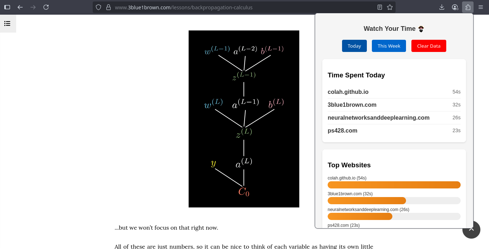

# Watch Your Time 

A simple, privacy-focused Firefox add-on that tracks time spent on websites. No external servers, no tracking, no analytics!

> Switching tabs quickly refreshes the time tracked.

## Features
- **Automatic Time Tracking** - Tracks time spent on each website automatically
- **Privacy First** - All data stored locally in your browser, never sent anywhere
- **Clean Dashboard** - View your top 5 most visited sites with visual bar charts, no external lib used
- **Easy Reset** - Clear all data with one click, just in case...

## Installation (for devs)

1. Clone this repository or download the files
2. Open Firefox and navigate to `about:debugging`
3. Click "This Firefox"
4. Click "Load Temporary Add-on"
5. Select the `manifest.json` file from this project
6. The extension icon will appear in your toolbar

## Usage

Simply install the extension and browse normally! Click the extension icon in your toolbar to see:

- Time spent on your most visited websites
- Visual bar chart showing relative time distribution
- Toggle between daily and weekly views
- Clear all data when needed

## Screenshots

## Privacy!!!

- **No external connections** - Everything stays on your device
- **No analytics or tracking** - I don't collect any data
- **Open source** - Check the code yourself on [my github](https://github.com/ps428/watch-your-time)

## Technical Details

- Built with vanilla JavaScript
- Uses Firefox WebExtensions API
- Manifest V2 compatible
- Minimal permissions required (storage, tabs, activeTab)
- Yeah I made this logo with Canva, see the eye carefully :eye:

## License

Open source - feel free to use, modify, and distribute!

---
